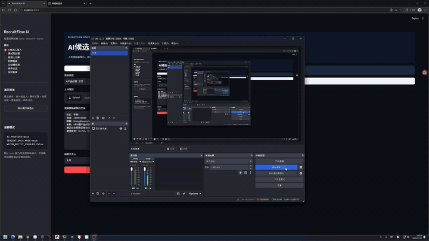

# RecruitFlow AI

RecruitFlow AI 是一个面向 HR 招聘流程的轻量 AI 应用 Demo，用于把简历和面试官群反馈自动转化为结构化招聘数据。

它不是完整 ATS，而是聚焦面试作业中的核心闭环：

```text
简历进入 -> AI解析与推荐 -> HR确认 -> 推送面试官群
-> 反馈解析 -> 状态更新 -> 文档同步 -> 数据看板
```

## 功能模块

- AI 候选人录入：上传 PDF / DOCX / TXT 或粘贴简历文本。
- 岗位匹配推荐：结合岗位 JD 自动生成匹配点、风险点和推荐语。
- 候选人台账：自动创建候选人和申请记录。
- 企业微信推送：支持 Webhook，未配置时自动进入 Mock 模式。
- 面试官反馈解析：识别“可以约面 / 不合适 / 进入复试 / 发Offer”等意图。
- 状态机校验：避免不合法流程覆盖招聘数据。
- 腾讯文档同步：MVP 默认写入本地 Mock CSV，真实 API 通过适配器扩展。
- 招聘看板：展示阶段漏斗、岗位分布和平均匹配分。

## Demo 视频

GitHub 首页可直接查看 Demo 动图预览：



高清录屏：

[点击播放 MP4 视频](assets/demo.mp4)

## Demo 展示流程

Demo 视频按照以下顺序展示：

```text
岗位配置
  -> AI候选人录入
  -> 企业微信群
  -> 面试官反馈
  -> 候选人台账
  -> 招聘看板
  -> 事件日志
```

完整文字说明见：

- [Demo 流程说明](docs/demo-script.md)
- [项目架构说明](docs/architecture.md)
- [项目实施计划](docs/project-plan.md)

## 快速开始

推荐 Python 3.12。

```bash
python -m venv .venv
.venv\Scripts\activate
pip install -r requirements.txt
copy .env.example .env
streamlit run app.py
```

macOS / Linux:

```bash
python -m venv .venv
source .venv/bin/activate
pip install -r requirements.txt
cp .env.example .env
streamlit run app.py
```

默认使用 `AI_PROVIDER=mock`，不需要 API Key 也可以完整演示。

## 接入真实模型

在 `.env` 中配置：

```env
AI_PROVIDER=deepseek
AI_API_KEY=你的Key
AI_BASE_URL=https://api.deepseek.com
AI_MODEL=deepseek-chat
```

也可以换成其他 OpenAI-compatible 模型服务。

## 项目结构

```text
recruitflow-ai-mvp/
├─ app.py
├─ recruitflow/
│  ├─ ai/
│  ├─ core/
│  ├─ integrations/
│  ├─ ui/
│  └─ utils/
├─ scripts/
├─ docs/
├─ samples/
└─ data/
```

## 48小时 MVP 路线

1. 项目初始化、数据库和状态机。
2. 简历上传、文本抽取、AI结构化解析。
3. 岗位匹配和标准化推荐语。
4. HR确认入库、企业微信推送、腾讯文档 Mock 同步。
5. 面试官反馈解析和状态更新。
6. 招聘台账、漏斗看板、事件日志。
7. README、Demo脚本、部署说明。

## 说明

本项目为从零搭建的轻量 Demo，避免引入大型 ATS 的无关模块，便于快速演示 AI 在招聘流程中的实际落地能力。
